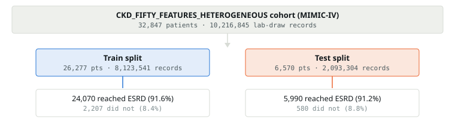
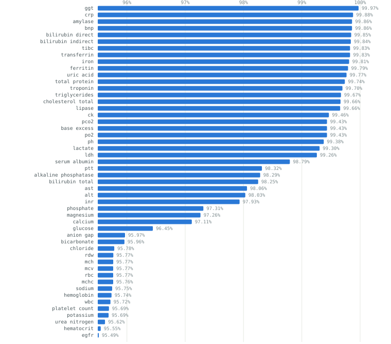
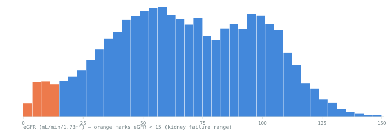
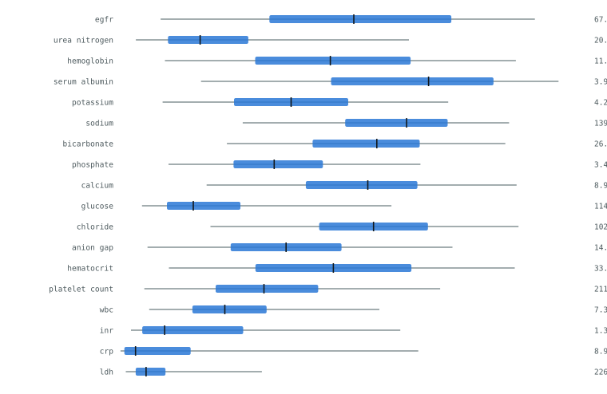
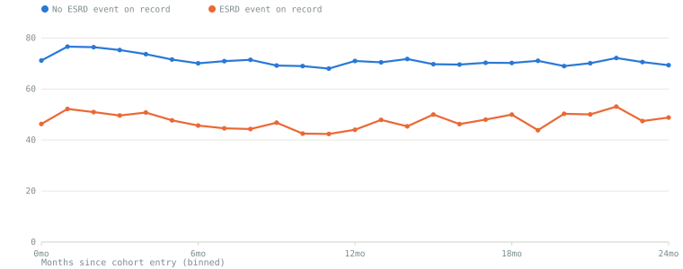
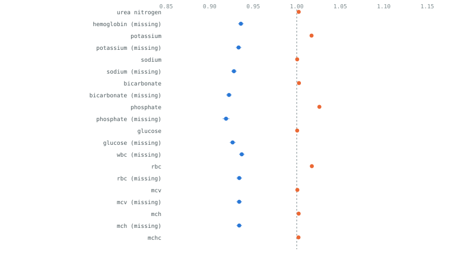

# What the cohort looks like before any model finishes training

*CKD Fifty-Feature Heterogeneous · Data-Only Findings*

All five replications draw on byte-identical data (verified by checksum), so these figures are computed once and hold for every rep. Six of sixteen planned figures from the Visualization Plan are buildable today without waiting on the in-flight model training; two more turned out not to be what they first appeared.

| Total patients | Train patients | Test patients | Lab-draw records | Reached ESRD |
|---:|---:|---:|---:|---:|
| 32,847 | 26,277 | 6,570 | 10.2M | 91.5% |

---

## 01 / COHORT — Cohort flow

> **30,060 of 32,847 patients (91.5%) have an ESRD event on record** — an unusually high rate for a general CKD cohort, worth confirming with whoever defined the inclusion criteria before it's reported as a base rate.

Train and test event rates match closely (91.6% vs. 91.2%), so the split looks stratified or at least not badly imbalanced on the outcome — a quick sanity check worth having before trusting any of the discrimination metrics downstream.

---

## 02 / MISSINGNESS — Missingness is structural, not clinical

> Every one of the 50 labs is missing in **95.5–99.97%** of records, and the missingness indicators are mutually near-exclusive (mean pairwise correlation **−0.016**) — because each row is one single lab-draw event, not a per-patient snapshot. This is a data-shape fact, not a clinical missingness pattern.

**Why this isn't "informative missingness" in the usual sense**

The extraction pipeline (`time_series_store.py`) builds one row per lab measurement: for a given row, exactly one of the 50 labs is populated and the other 49 are flagged `_missing=1` with a placeholder value. So a lab's missingness rate is just `1 −` its share of all draws — `egfr` is drawn most often (95.49% missing, i.e. present in 4.51% of rows) and `ggt` least (99.97% missing). The literature on informative EHR missingness (labs not ordered because a clinician judged them unnecessary) doesn't directly apply here without first reshaping to one-row-per-patient-per-timepoint. Worth flagging to whoever's writing the paper before this gets framed as a clinical finding.

---

## 03 / FEATURE CORRELATION — The planned correlation heatmap isn't computable as the data is shaped

> Checked directly: of 2,500 lab×lab correlation cells, only the **50 diagonal entries** (a lab against itself) are non-null. Every off-diagonal pair is `NaN`.

**Root cause**

Same structural fact as above, taken to its conclusion: since each row has only one lab populated, no row ever has two different labs simultaneously non-missing — there's no overlapping sample to correlate on. Computing real lab–lab correlations would need a reshape first (e.g. pivot to patient×day and forward-fill within a window), which is a separate, nontrivial preprocessing step, not a plotting change. Flagging this now so it isn't discovered mid-write-up: item #5 in the Visualization Plan needs a reshape step added to the plan, not just a chart.

---

## 04 / DISTRIBUTIONS — Value distributions

> eGFR is bimodal-leaning with a long low tail: median 67.9, but 5% of readings fall below 16.9 — squarely in kidney-failure range, consistent with the cohort's 91.5% ESRD rate.

Eighteen more of the 50 labs, shown as 5th–95th percentile ranges (box = interquartile range, tick = median) — the same percentile data exists for all 50 in the underlying output, this is a representative subset for readability.

---

## 05 / EGFR TRAJECTORY — eGFR trajectory by outcome

> Clean separation from month 1 onward: patients who reach ESRD track **20–25 mL/min lower** mean eGFR throughout follow-up than those who don't — the kind of signal that motivates using a time-varying model over a single-timepoint one.

---

## 06 / COX HAZARD RATIOS — Cox model coefficients (rep1)

> Top 20 of 100 fitted coefficients by significance. Rep5's cox model, verified independently, reproduces every coefficient to **~1e-15** — floating-point noise, i.e. numerically identical. Since the data is identical across all 5 reps and the Cox fit is deterministic, cox will show **zero cross-rep variance** in the eventual results table; only the deep models' training stochasticity will produce real spread.

Legend: 🟠 hazard ratio > 1 (raises risk) · 🔵 hazard ratio < 1 (lowers risk) · dashed line = HR 1.0 (no effect)

Reading the pattern: raw lab values mostly sit just above 1.0 (small per-unit effects, expected given continuous covariates), while the `_missing` indicators mostly sit below 1.0 — being flagged as missing for a given lab in a given row lowers modeled risk relative to the reference row, which given the one-lab-per-row structure (Section 03) is really picking up which lab was drawn that visit, not a clinical absence signal. Worth keeping in mind when interpreting `_missing` coefficients for the paper.

---

Built from `generated_data/rep1` and `rep5` on Aug 18, 2026. Six of sixteen items from the Data & Results Visualization Plan ([CKD_FIFTY_FEATURES_EXPERIMENT_PLAN.md](CKD_FIFTY_FEATURES_EXPERIMENT_PLAN.md)); the remaining ten need at least one trained deep-survival model, none of which have finished yet. Two findings above (missingness shape, correlation non-computability) revise how items #3 and #5 in that plan should be read going forward.
